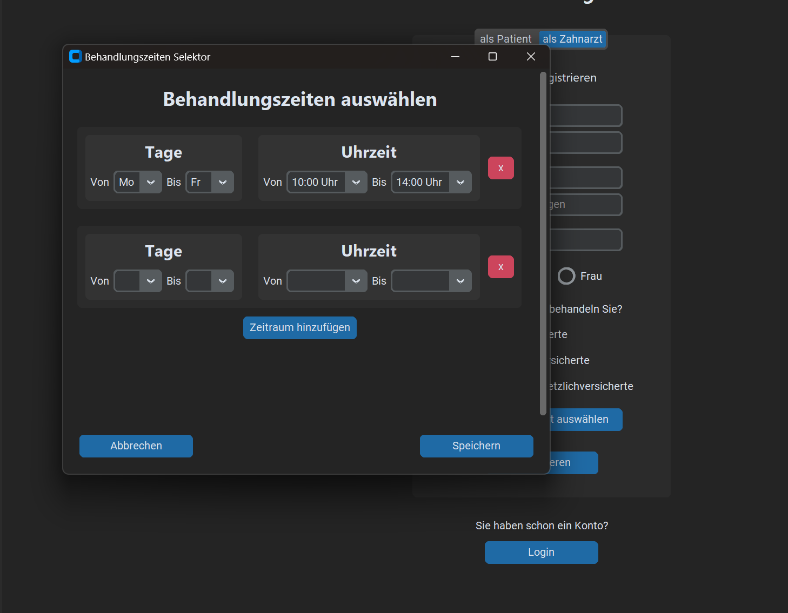
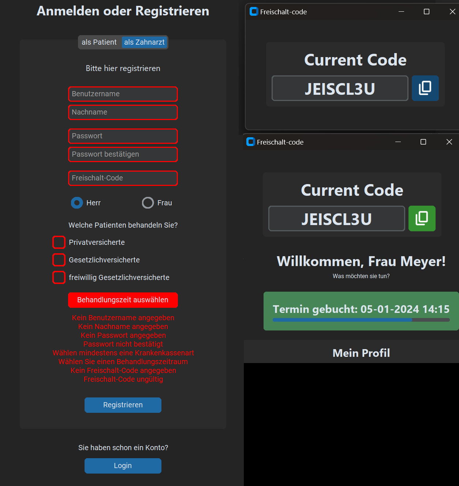
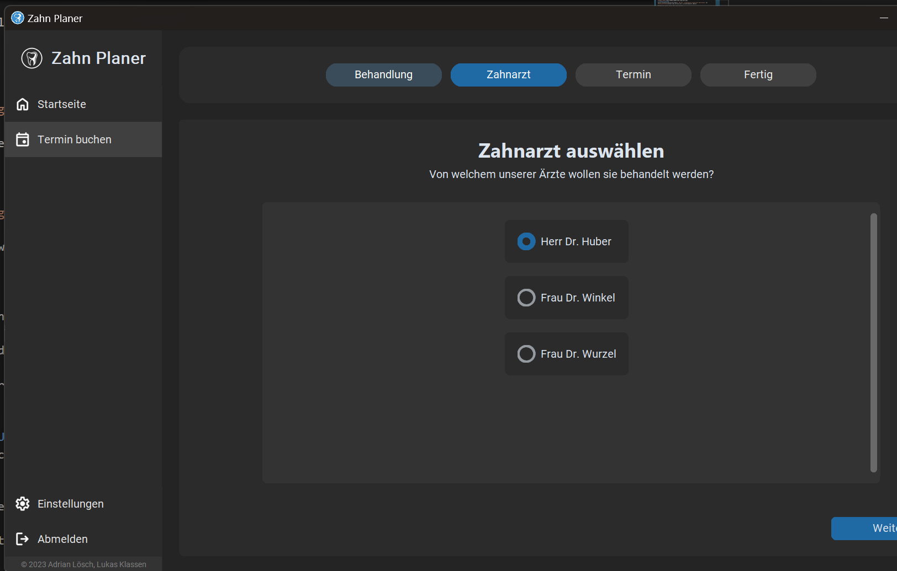
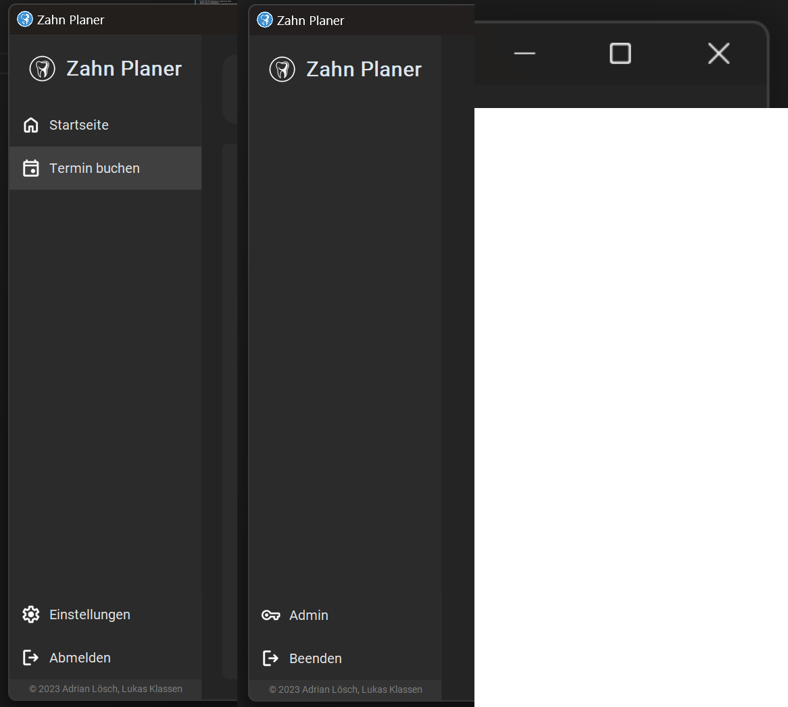
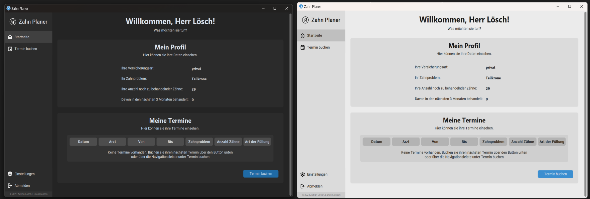

# Projektvorstellung
Unsere Projektvorstellung des Moduls `505 GUI - Programmieren Graphischer Oberflächen` der [Hochschule Worms](https://www.hs-worms.de/) im Wintersemester 2023/24

Projekt von `Adrian Lösch` und `Lukas Klassen`

# Inhalt
1. [Was war unser Projekt](#1-was-war-unser-projekt)
2. [Umsetzung](#2-umsetztung)
3. [Features](#3-features)
4. [GUI](#4-gui)
5. [Verkaufsargumente](#5-verkaufsargumente)

## 1 Was war unser Projekt?

### Aufgabenstellung
- [Genaue Aufgabenstellung (Word)](./docs/Aufgabenstellung.docx)
- GUI für einen Wochenbehandlungsplan für Zahnärtze und deren Patienten
- Zusammenstellung der Behandlungszeiten und Kosten
- Patienten wählen Termine selbst
- Ärzte und Patienten haben übersicht über gebuchte Termine
- Einlesen, der zur Verfügung gestellten [Excel-Datei](./docs/Patienten_Zahnärzte_Kosten.xlsx)

## 2 Umsetztung

### Programmierbasis
- Programmiersprache: Python 3.11
- Framework **Tkinter**
    - **Customtkinter** als mordernisiertes Tkinter benutzt
- **Diverse Packages**
    - Pandas
        - parsen der Excel-Datei
        - handhaben der Daten (Dataframes)
    - bcrypt
        - Passwortverschlüsselung
        - Hashing/Salting
    - Pillow
        - Anzeigen von Icons und Logos
    - Interne Libraries

### Programmaufbau
- [Login/Registration](#loginregistration)
- [Einstellungen](#einstellungen)
- [Terminübersicht](#terminübersicht)
- [Terminbuchung](#terminbuchung)

## 3 Features

### Login/Registration
- Login mit **eindeutigem** Benutzernamen und Passwort
- Loginvalidierung und Fehlermeldungen
---
- Registrierung als Patient
    - Benutzername, Name und Namenspräfix
    - Passwort und Passwortbestätigung
    - Krankenkassenart und Dentale Problematik
    - Anzahl der zu behandelnden Zähne
- Registrierung als Zahnarzt
    - Eingeben der generellen Daten (siehe Patient)
    - Freischalt-Code von Admin
    - Behandlungszeiten Wählen

### Einstellungen
- Farbdesign
    - System, Hell, Dunkel
- Passwort ändern
    - Eingabe von altem Passwort benötigt
    - Validierung vie bei Anmeldung

### Terminübersicht
- Direkt nach der Anmeldung mit generellen Daten
- Eigener Tab in Seitenleiste
- Alle relevanten Informationen zu gebuchten Terminen (ausgenommen vergangene)
- Zeitlich angeordnet
- Für Zahnärzte sowie Patienten

### Terminbuchung
- Eigener Tab in Seitenleiste
- interaktive Progressbar
- Auswahl der Termindetails
    - Zahnanzahl und Füllmaterial
    - dynamische Kostenberechnung
- Auswahl des Arztes
    - nur Ärzte mit passender Krankenkassenart
- Auswahl der Behandlungszeit
    - detaillierte Wochenübersicht
        - Zeitraum der nächsten 3 Monate
        - Anzeigen des Verfügbaren Zeitraums des Arztes 
        - Anzeigen bereits verbuchter Termine
    - Terminauswahl
        - Aktuell gewählte Woche
        - verfügbarer Tag in der Woche
        - verfügbarer Zeitraum des bestimmten Tages
        - visuelles Anzeigen des gewählten Termins
        - möglichkeit Termin wieder zu ändern

## 4 GUI

### Leitlinien/Prinzipien der Benutzerfreundlichkeit

#### Kriterien für benutzerfreundliches GUI-Design (nach ISO-Standard)
1. Aufgabenangemessenheit
    - minimieren unnötige Interaktionen
        - Auswahl für ganze Zeiträume im Behandlungszeiten Selektor
        - Bei Änderung in Buchung müssen nur relevante Daten erneut eingegeben werden

2. Selbstbeschreibungsfähigkeit
    - Platzhalter in Eingabefeldern
    - Detaillierte Rückmeldung für wichtige Ereignisse
        - Fehlermeldungen, Bestätigung

3. Steuerbarkeit
    - Jederzeit abmeldbar
    - Nachträgliche Änderungen bei Buchung

4. Erwartungskonformität 
    - Standard Window Icons
    - Beenden/Abmeldenbuttons mit Icons an gleicher Stelle
    - Erwartungskonformes behandeln von Pop-Up Fenstern

5. Fehlertoleranz
    - Validierung für alle möglichen Eingaben mit detailliertem Feedback
6. Individualisierbarkeit
    - Farbschema der GUI individuell anpassbar

7. Lernförderlichkeit
    - Tooltips für Shortcuts

#### Usabilty Heuristiken (nach Nielsen)
1. Sichtbarkeit des Systemstatus
    - Feedback duch detaillierte Fehlermeldungen
    - Buttenfarben und states
2. Übereinstimmung von System und Wirklichkeit
    - Icons nach Google Standard (der Wirklichkeit nachempfunden)
3. Nutzerkontrolle und Freiheit
    - jeder Prozess abbrechbar
    - Rückschritte möglich
4. Beständigkeit und Standards
    - Google Icons
    - leicht differenzierbare Standardbutton Benennung
5. Fehlervermeidung
    - Validierung
    - nur verfügbare Daten anzeigen/auswählen
6. Wiedererkennung statt Erinnerung
    - Verfügbare Optionen jederzeit direkt Sichtbar
    - Sidebar
7. Flexibilität und Effizienz
    - Shortcuts
8. Ästetisches und minimalistisches Design
    - nur relevante Informationen
    - moderne aufgeräumtes Design
        - klare Differenzierung von Inhalten (Frames)
9. Hilfestellung beim erkennen, bewerten und beheben von Fehlern
    - präzises verständliches Feedback bei Fehlern
    - hervorhebung falscher Eingaben
10. Hilfe und Dokumentation
    - Tooltips
    - Feedback
    - Platzhalter

## 5 Verkaufsargumente
- Sicherheit
    - Passwort hashing/salting
    - Freischalt-Code
- Benutzerfreundlichkeit
- modernes ansprechendes Design
